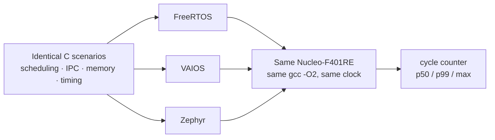

A flight controller is judged in microseconds. Every millisecond it must read its sensors, estimate the aircraft's attitude, run its control loops, and drive the motors — on the same schedule, every cycle, without exception. The operating system underneath is what decides whether that schedule holds.

VAIOS is the real-time operating system we are building as the foundation of our flight-control stack. To understand where it stands, we benchmarked it against FreeRTOS and Zephyr — the two real-time operating systems most widely deployed in embedded flight software today. This post walks through the full set of results: scheduling, inter-task communication, dynamic memory, timing accuracy, and code footprint.

## The test platform

A comparison between operating systems means something only if the operating system is the one thing that changes. So before measuring anything, we fixed everything else.

Every figure below was recorded on the same physical board — a real STM32F401RE microcontroller, the class of chip that flies a small drone. All three systems were built with the same compiler at the same optimisation level, run from the same clock, and given the same heap, scheduler tick, and priority scheme.

| Setting | Value |
|---------|-------|
| Board | ST Nucleo-F401RE |
| MCU | STM32F401RE — Cortex-M4F, 84 MHz, 512 KB flash, 96 KB SRAM |
| Toolchain | arm-none-eabi-gcc, built at `-O2` |
| Heap size | 32 KB, identical allocator configuration class |
| Scheduler tick | 1 ms |
| Priority levels | 8, strict preemptive |
| FreeRTOS | FreeRTOS-Kernel v11.1.0 |
| Zephyr | `nucleo_f401re` board target |

Logging was switched off inside every measurement window, because writing a single line to the serial port costs thousands of cycles and would drown out the very thing being measured. With those variables held constant, any difference in the results belongs to the kernel.

## How we measure

Most timing on embedded systems is done with the millisecond tick. For this work that is far too coarse — a context switch takes a few microseconds, and a millisecond clock would simply report zero.

Instead we used the Cortex-M4's hardware cycle counter, which resolves time to a single CPU cycle — about 12 nanoseconds at 84 MHz. **At this clock, 84 cycles is roughly one microsecond**, a conversion worth keeping in mind for the tables below.

Rather than averages, every latency test records its full distribution across thousands of samples. An average hides the worst case, and for a control loop the worst case is the one that matters: a system that is usually fast but occasionally stalls will still drop an aircraft. The figures below are median values; where the tail behaves differently from the median, we call it out.

## Scheduling and context switches

The context switch is the kernel's most fundamental operation — the cost of saving one task and resuming another. We measure three variants: a plain switch between two equal-priority tasks that yield to each other, the same switch when the tasks use the floating-point unit (which adds 16 more registers to save and restore), and the *task wake latency* — the time from signalling a sleeping task to that task running its first instruction.

| Metric | Unit | VAIOS | FreeRTOS | Zephyr | Leader |
|--------|------|-------|----------|--------|--------|
| Context switch — task yield | cycles | 240 | **164** | 304 | FreeRTOS |
| Context switch — FPU task | cycles | 311 | **236** | 379 | FreeRTOS |
| Task wake latency | cycles | **494** | 540 | 1,196 | VAIOS |

FreeRTOS has the fastest bare context switch — about 2.0 µs against VAIOS's 2.9 µs and Zephyr's 3.6 µs — and two decades of tuning on this exact processor family are visible in that number. VAIOS turns the result around on task wake latency, the metric closest to real flight behaviour: it wakes a sleeping task in roughly 5.9 µs, ahead of FreeRTOS at 6.4 µs and well ahead of Zephyr at 14 µs. That is the step that turns a fresh sensor reading into a control response, so it is the one we weight most heavily. A separate correctness check — confirming a high-priority task immediately preempts a lower-priority one — passed on all three systems.

## Inter-task communication

Tasks rarely run in isolation; they hand data and control to one another through semaphores and mutexes. We measure an uncontended semaphore give-and-take, a two-task "ping-pong" where control bounces back and forth, and an uncontended mutex lock-and-unlock pair.

| Metric | Unit | VAIOS | FreeRTOS | Zephyr | Leader |
|--------|------|-------|----------|--------|--------|
| Semaphore give + take (uncontended) | cycles | 243 | 264 | **214** | Zephyr |
| Semaphore round-trip (2-task ping-pong) | cycles | **1,284** | 2,829 | 4,446 | VAIOS |
| Mutex lock + unlock (uncontended) | cycles | 449 | 333 | **266** | Zephyr |

The three systems are close on a single uncontended semaphore operation. The gap opens on the two-task round-trip, which exercises the full path — signal, switch, run, switch back: VAIOS completes it in roughly half the cycles FreeRTOS needs and under a third of Zephyr's. Zephyr has the leanest mutex path of the three. We also tested priority inheritance, the mechanism that stops a low-priority task from blocking a high-priority one through a shared lock; all three resolve the basic case correctly, and VAIOS currently does so more slowly than its peers — a path we are actively optimising.

## Dynamic memory

Flight software allocates and frees memory constantly — telemetry buffers, message payloads, transient state. An allocator that is fast on a clean heap but slow once that heap is fragmented is a poor fit for a long flight, so we measure both.

| Metric | Unit | VAIOS | FreeRTOS | Zephyr | Leader |
|--------|------|-------|----------|--------|--------|
| Allocate 8 B | cycles | 284 | **271** | 369 | FreeRTOS |
| Allocate 64 B | cycles | **258** | 271 | 369 | VAIOS |
| Allocate 512 B | cycles | **241** | 271 | 369 | VAIOS |
| Allocate 4 KB | cycles | **226** | 272 | 369 | VAIOS |
| Allocate on a fragmented heap | cycles | **259** | 1,122 | 459 | VAIOS |
| Free a block (typical) | cycles | **242** | 245 | 380 | VAIOS |
| Allocator throughput | ops/sec | **324,372** | 264,526 | 206,765 | VAIOS |

Dynamic memory is VAIOS's strongest area. Its allocation cost is roughly flat across block sizes and slightly faster than FreeRTOS on everything but the smallest request. The clearest result is the fragmented-heap row: after the heap has been broken into many small holes, FreeRTOS's allocation cost rises more than fourfold to over 1,100 cycles, while VAIOS stays near 260 — essentially unchanged. Sustained over a mixed alloc-and-free workload, that consistency shows up as throughput: VAIOS handles about 324,000 operations per second, ahead of FreeRTOS and Zephyr.

## Timing and the 1 kHz control loop

A control loop is only as good as its timing. We measure how accurately a task wakes from a 5 ms sleep, the period stability of a loop running at the drone's 1 kHz control rate, and the end-to-end latency of a simulated sensor pipeline — an IMU sample passing through fusion and into a PID controller.

| Metric | Unit | VAIOS | FreeRTOS | Zephyr | Leader |
|--------|------|-------|----------|--------|--------|
| Delay accuracy — 5 ms sleep | µs | 4,999 | 4,999 | 6,000 | VAIOS / FreeRTOS |
| 1 kHz loop — median jitter | µs | 0 | 0 | 0 | tie |
| 1 kHz loop — worst-case jitter | µs | **63** | 665 | 643 | VAIOS |
| IMU → fusion → PID pipeline | cycles | 1,422 | **1,148** | 2,090 | FreeRTOS |

VAIOS and FreeRTOS wake from a 5 ms sleep within a microsecond of the target; Zephyr wakes a full millisecond late, a consequence of how it rounds timeouts onto the tick boundary. All three hold the 1 kHz loop perfectly at the median. They diverge at the tail: VAIOS's worst single-cycle deviation across the run was 63 µs, against roughly 650 µs for both peers — a meaningful margin for a loop with a 1,000 µs budget. On the end-to-end IMU pipeline, FreeRTOS is fastest at about 13.7 µs, with VAIOS at 16.9 µs and Zephyr at 24.9 µs.

## Memory footprint

Finally, the size of the compiled image — the flash it occupies and the static RAM it reserves at boot.

| Metric | Unit | VAIOS | FreeRTOS | Zephyr | Leader |
|--------|------|-------|----------|--------|--------|
| Flash image | bytes | 56,488 | **24,749** | 41,076 | FreeRTOS |
| Static RAM | bytes | 41,504 | **38,376** | 64,805 | FreeRTOS |

FreeRTOS produces the smallest image on both counts. Part of VAIOS's flash figure is its hardware abstraction layer rather than the kernel itself, and a kernel-only measurement is on our list — but on a 512 KB flash, 96 KB SRAM part, all three fit comfortably with room to spare for the application.

## What the numbers show

No single system leads every metric — the expected outcome for three mature designs built around different priorities.

VAIOS leads on dynamic memory and on inter-task communication throughput, holds the best task wake latency and the tightest worst-case control-loop jitter, and is competitive on raw context-switch cost. FreeRTOS leads on the bare context switch, the IMU pipeline, and code size. Zephyr leads on single semaphore and mutex operations. Priority inheritance and footprint are the two areas where VAIOS has clear ground to make up.

Taken together, the picture is a kernel that is strongest where a flight controller spends most of its time — memory and inter-task communication — and steady under timing pressure.

## What it means for flight control

A drone's control loop runs at 1 kHz. In our tests all three operating systems hold that cadence at the median without strain; for an unloaded loop, the kernel is not the limiting factor.

The differences emerge under pressure — when interrupts, memory traffic, and competing tasks all arrive at once. That is where VAIOS's fast, fragmentation-resistant allocator, quick task wake-ups, and tight worst-case jitter carry weight, and where FreeRTOS's lean context switch keeps it strong. For the workload we are building toward — sensor fusion, control, and telemetry running together on a single Cortex-M4 — VAIOS is already a capable foundation.

## What's next

This is one run on one board, and the work continues. Ahead of us: deeper priority-inheritance scenarios with locks nested across several tasks, a true interrupt-to-task latency path measured from a hardware timer, a kernel-only footprint measurement, and extended soak testing over many hours to confirm there are no leaks or missed deadlines under sustained load. We also intend to publish the benchmark harness itself, so that anyone — including the FreeRTOS and Zephyr communities — can reproduce these measurements and check them.

We will share the next set of numbers as the suite grows.
