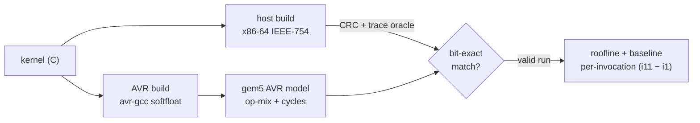

The plan was a coprocessor. An 8-bit AVR runs flight-control math.
That means EKF, AHRS, PID, plus some int8 inference. Most of its
cycles go to software floating point. The intuition was simple. Bolt a
wide SIMD unit on the side. Run many lanes in parallel. Win big. So I
started [AVR-XPU](https://github.com/ragnar-vallhala/AVR-XPU) to
explore exactly that.

First, the responsible step. Measure before building. I ran the real
workloads through a validated gem5 AVR model. Three questions, with
data, not intuition. What do the kernels actually use? Is the idea even
compute-bound? How does AVR softfloat compare to a real FPU?

This post is what the measurement said. It killed the wide vector unit.
It kept the coprocessor. And it changed what the coprocessor should be.

## The setup

The model is a custom gem5 AVR core. It is functionally and cycle
validated against a real ATmega328P. For this study I hardened it and
instrumented it. Four changes, each driven by a measurement need.

- **Hard-halt on unknown opcodes.** The port used to silently skip
  undecoded instructions. That corrupts results quietly. Now it halts
  and prints the opcode and PC. ISA gaps became visible.
- **ELPM + RAMPZ.** Implementing these unblocked larger working sets.
  The C runtime copies `.data` with `ELPM` on big devices.
- **Op-mix instrumentation.** At exit the CPU emits per-mnemonic
  instruction and cycle histograms. Plus per-function instruction,
  cycle, and call-count histograms. This is the raw material.

Every kernel is compiled twice. A host reference on x86-64, IEEE-754
round-to-nearest. An AVR build with avr-gcc softfloat, same semantics.
Both emit checkpoint traces and a CRC-32 over the output. A gem5 run is
valid only if it halts cleanly and matches the host bit-for-bit. For
the IEEE-mandated ops they agree exactly. So the host is a
deterministic oracle. Even for kernels too big for real silicon.

Per-invocation cost uses a two-run difference. Run each kernel once,
then eleven times. Then $(\text{metric}_{11} - \text{metric}_1)/10$
cancels the fixed startup. What remains is one clean invocation.

Thirteen kernels span three categories. Estimation and control in
fp32. DSP in fp32. Inference in int8.

| ID | data | kernel |
|---|---|---|
| 11-ekf | fp32 | PX4-ECL EKF covariance predict, 24-state |
| 12-ahrs | fp32 | Madgwick 6-axis IMU attitude update |
| 13-quaternion | fp32 | Hamilton product, normalize, rotate, DCM |
| 14-control-pid | fp32 | cascaded rate-PID step |
| 15-control-allocation | fp32 | quad-X control allocation |
| 21-fir | fp32 | FIR filter, 16 taps, 48-sample block |
| 22-biquad | fp32 | biquad IIR cascade, 4 sections |
| 23-fft | fp32 | radix-2 DIT FFT, N=64 |
| 24-matmul | fp32 | dense matrix multiply 8×8×8 |
| 25-dotprod | fp32 | vector dot product, N=64 |
| 31-conv2d | int8 | quantized 2D conv + requantize |
| 32-fc | int8 | quantized fully-connected + requantize |
| 33-maxpool | int8 | 2×2 max pooling, 4 channels |

All thirteen validated bit-exact against the host. No run hit an
unresolved ISA gap.

## §1 — Where the cycles go

The headline is the cost of software float. Kernels with little real
work still retire hundreds of thousands of instructions. The EKF
covariance predict alone is 800k.

| workload | sim. insts | cycles | CPI | comp. insts/byte |
|---|--:|--:|--:|--:|
| 11-ekf | 800,482 | 1,022,029 | 1.28 | 32.7 |
| 23-fft | 243,947 | 346,192 | 1.42 | 8.0 |
| 31-conv2d | 242,732 | 333,196 | 1.37 | 10.7 |
| 22-biquad | 204,933 | 290,201 | 1.42 | 9.2 |
| 21-fir | 183,221 | 249,283 | 1.36 | 19.6 |
| 24-matmul | 145,892 | 198,214 | 1.36 | 23.1 |
| 32-fc | 131,653 | 176,021 | 1.34 | 21.9 |
| 25-dotprod | 47,737 | 63,560 | 1.33 | 27.4 |
| 12-ahrs | 17,133 | 23,257 | 1.36 | 20.8 |
| 13-quaternion | 16,185 | 21,512 | 1.33 | 14.5 |
| 14-control-pid | 12,965 | 15,962 | 1.23 | 14.3 |
| 15-control-allocation | 9,429 | 11,708 | 1.24 | 12.6 |

Each fp operation becomes a softfloat call. That is 50 to 170
instructions for one add or multiply. The arithmetic helpers dominate
everything. This is the tax the coprocessor was meant to remove.

## §2 — The roofline

Now the real question. If hardware arithmetic removes the softfloat
tax, what is the next ceiling? The roofline model answers it.

The proposed core has a memory roof and a compute roof. AVR data memory
moves about 0.5 bytes per cycle. LD/ST cost ~2 cycles per byte. The
compute roof at SIMD width $W$ is $W$ ops per cycle. The two meet at a
ridge intensity:

$$I_{\text{ridge}} \;=\; 2W \;\; \text{ops/byte}.$$

Where a kernel sits decides what helps. Right of the ridge, more lanes
help. Left of it, only bandwidth helps. Here is the per-invocation data.
`I` is arithmetic intensity. `sp@W` is attainable speedup over softfloat
at width $W$.

| workload | kind | ops/inv | bytes | cyc/op | I (op/B) | helper % | ridgeW | sp@1 | sp@4 | sp@8 |
|---|---|--:|--:|--:|--:|--:|--:|--:|--:|--:|
| 32-fc | int8 | 2,048 | 3,338 | 20.0 | 0.61 | 58.5% | 0.3 | 6.1 | 6.1 | 6.1 |
| 31-conv2d | int8 | 10,368 | 19,738 | 24.1 | 0.53 | 59.1% | 0.3 | 6.3 | 6.3 | 6.3 |
| 12-ahrs | fp | 181 | 680 | 123.9 | 0.27 | 98.2% | 0.1 | 16.5 | 16.5 | 16.5 |
| 25-dotprod | fp | 131 | 528 | 131.1 | 0.25 | 83.8% | 0.1 | 16.3 | 16.3 | 16.3 |
| 24-matmul | fp | 1,034 | 4,644 | 130.7 | 0.22 | 83.5% | 0.1 | 14.6 | 14.6 | 14.6 |
| 11-ekf | fp | 2,500 | 12,788 | 110.5 | 0.20 | 97.8% | 0.1 | 10.8 | 10.8 | 10.8 |
| 21-fir | fp | 1,586 | 8,254 | 137.5 | 0.19 | 79.0% | 0.1 | 13.2 | 13.2 | 13.2 |
| 13-quaternion | fp | 145 | 806 | 103.9 | 0.18 | 85.0% | 0.1 | 9.3 | 9.3 | 9.3 |
| 22-biquad | fp | 2,162 | 19,316 | 123.2 | 0.11 | 85.8% | 0.1 | 6.9 | 6.9 | 6.9 |
| 23-fft | fp | 2,754 | 25,292 | 109.9 | 0.11 | 77.1% | 0.1 | 6.0 | 6.0 | 6.0 |
| 15-control-allocation | fp | 36 | 332 | 157.3 | 0.11 | 77.5% | 0.1 | 8.5 | 8.5 | 8.5 |
| 14-control-pid | fp | 51 | 603 | 173.4 | 0.08 | 90.9% | 0.0 | 7.3 | 7.3 | 7.3 |

Two findings, in order.

**First: the baseline is compute-bound, on softfloat.** Between 58% and
98% of cycles sit in arithmetic helpers. That is ~100 to 170 cycles per
fp op. A scalar hardware FP/MAC datapath removes it. That alone is a
**6× to 16× speedup** — the `sp@1` column. So far the coprocessor looks
great.

**Second: arithmetic intensity is low. Really low.** Measured
intensities run 0.08 to 0.61 ops/byte. The scalar ridge sits at 2
ops/byte. Every kernel is far to the left. Every `ridgeW` is below 1.

Now look at the last three columns. The speedup at width 1, 4, and 8 is
identical. Once arithmetic moves to hardware, the kernels go
memory-bound. The lanes sit idle, waiting on loads. Wide SIMD buys
nothing. The lanes have no data to chew on.

## §3 — Against a real FPU

One more check. Maybe softfloat is the wrong baseline. So I ran the same
kernels on ARM64 and RISC-V in the same gem5. Both have hardware FP. The
output is IEEE-754 bit-identical across all three. The byte axis comes
from the memory controller, so it is architecture-independent.

| workload | AVR insts | ARM insts | RV insts | AVR/ARM | AVR/RV |
|---|--:|--:|--:|--:|--:|
| 12-ahrs | 16,368 | 216 | 245 | 75.9× | 66.8× |
| 11-ekf | 195,970 | 4,398 | 4,600 | 44.6× | 42.6× |
| 13-quaternion | 10,396 | 272 | 278 | 38.2× | 37.4× |
| 14-control-pid | 6,445 | 184 | 182 | 35.0× | 35.3× |
| 22-biquad | 187,133 | 5,583 | 5,340 | 33.5× | 35.0× |
| 25-dotprod | 12,520 | 463 | 466 | 27.0× | 26.9× |
| 23-fft | 210,060 | 9,045 | 10,386 | 23.2× | 20.2× |
| 24-matmul | 97,756 | 4,643 | 4,133 | 21.1× | 23.7× |
| 21-fir | 159,353 | 9,423 | 8,653 | 16.9× | 18.4× |
| 31-conv2d | 172,350 | 23,003 | 29,080 | 7.5× | 5.9× |

On the fp kernels, ARM64 needs **17 to 76× fewer instructions** than AVR
softfloat. RISC-V is similar. That is the FPU advantage. AVR turns each
fp op into a 50–170-instruction call. ARM and RISC-V do it in about one.

Throughput tells the same story. ARM and RISC-V hit 0.18 to 0.70
fp-ops/cycle. Near the scalar FP roof of 1. AVR softfloat manages 0.006
to 0.010. A 25 to 87× gap.

The int8 kernels show a smaller gap. All three do integer MACs there. So
the AVR penalty is just its 8-bit width, not softfloat.

## The verdict that killed the original plan

The machine I set out to build is wrong. Wide SIMD is the wrong answer.
The speedup is real. But width does not unlock it. The ceiling is memory
bandwidth. You don't raise that ceiling with more ALUs.

What the data argues for instead:

1. A **scalar hardware FP/MAC datapath.** That alone recovers the 6–16×.
   It removes the softfloat tax that dominates the baseline.
2. **More memory bandwidth.** Wider loads and a local scratchpad. That,
   not lane count, sets the post-FP ceiling.

There is a sharper point from §3. The AVR-XPU cannot beat an
FPU-equipped ARM or RISC-V on raw fp throughput. So its case is not
peak FLOPS. Its case is **energy and area** for a stripped,
domain-specific datapath. A minimal fp/int8 MAC, fed by enough
bandwidth, competing on energy-per-op.

My kill-criterion did fire. I had written it down at the start. Kill the
project if it is memory-bound. But it killed the right thing. It killed
wide SIMD, not the coprocessor. A lean arithmetic core still delivers
the win. It just should not be vector-wide.

## Why I'm glad I measured first

The elegant path was tempting. Spend a month on an 8-lane vector unit.
Then watch seven lanes starve at simulation time. Instead the analysis
was a harness, a validated model, and a spreadsheet. It redirected the
whole project before any RTL.

The cheapest mistake is one you catch in the model. Intuition about
bottlenecks is often wrong. A roofline plot shows where the bottleneck
actually is.

---

*The gem5 AVR model and ISA work live in a fork
([ragnar-vallhala/gem5](https://github.com/ragnar-vallhala/gem5),
branch `btp`). The harness, kernels, and every run-log live in
[AVR-XPU](https://github.com/ragnar-vallhala/AVR-XPU). All numbers and
figures here are from validated, bit-exact gem5 runs.*
