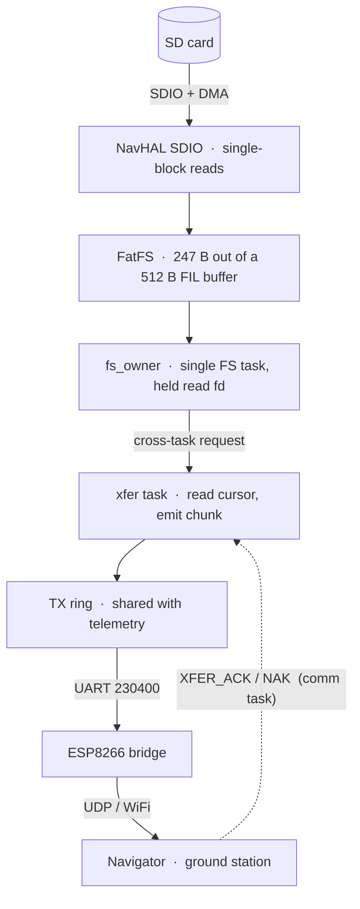
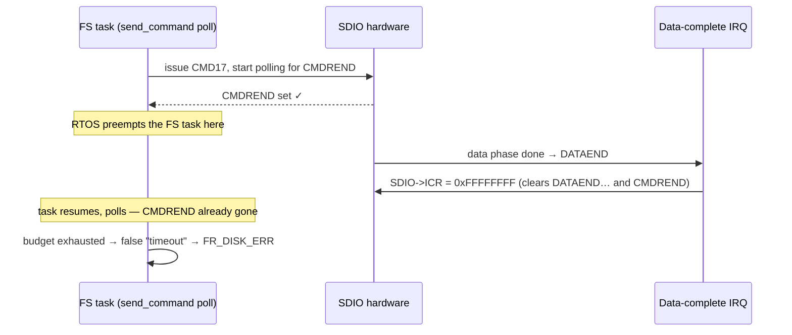

In the [last post](/engineering/first-wireless-rig-log/) I cut the cable: the
flight controller now talks to the ground over a UDP/WiFi bridge instead of
USB. The next thing I wanted was to move **files** across that link — pull a
blackbox log off the SD card, push a tune back — over a small, reusable
bulk-transfer substrate we call *xfer*, layered on the same NavLink protocol
the telemetry already speaks.

The acceptance test is the simplest thing imaginable. Upload a file to the
card. Download it back. Compare. The bytes should be identical.

They were not. Files up to a few hundred bytes round-tripped perfectly. At a
kilobyte and above, the download would either **stall partway** or come back
**subtly corrupted** — and which one, and *where*, changed every run. A
dashboard shows you none of this. A `sha256` mismatch tells you something is
wrong and nothing about why.

What follows is the eighteen-hour hunt that turned "everything ≥1 KB is
broken" into a byte-perfect 64 KB round-trip. The short version: the SD card
and the filesystem were innocent the entire time. Every bug lived in a
**seam** — between an interrupt and a poll loop, between two RTOS tasks — and
the only thing that found them was measuring the hardware directly instead of
reasoning about it.

---

## 1. The path a byte takes

A download is deceptively many hops. The ground station asks for a file; the
firmware reads it off the card 247 bytes at a time and streams those chunks
back, each self-describing with its own byte offset so a dropped one can be
re-requested. On the firmware side those 247-byte chunks are pulled through a
stack of layers, each on a different side of a task boundary:



Three properties of that diagram matter for everything below.

**The SD card is reached through exactly one task.** `fs_owner` is the sole
owner of the filesystem; every read, write, and `stat` funnels onto a single
FS task so two contexts can never touch FatFS at once. The xfer task doesn't
read the card directly — it hands a request across a queue and blocks.

**The download cursor is shared across two tasks.** The xfer task advances it
as it emits chunks. The *comm* task moves it backwards when the ground station
NAKs a missing chunk (`XFER_ACK` with a lower offset = "resume from here").
Two tasks, one integer, no lock. Hold that thought.

**The transfer competes with telemetry for the wire.** The xfer chunks share
the same UART TX ring as the 166 Hz telemetry stream. The link is ~23 KB/s
total; whatever telemetry uses, the download doesn't get.

Small files dodge most of this. A 247-byte file is one chunk: one read, one
emit, no resume, no cursor motion, no sustained contention. That's *why* they
worked — and why they told me nothing.

---

## 2. Why a dashboard can't find this

The first real decision was how to observe the bug without disturbing it. Two
constraints shaped everything.

First, **the bug needs the real system.** I have two bare-metal stress
harnesses: one that hammers the SDIO driver directly with no filesystem and no
RTOS, and one that drives FatFS single-threaded. Both pass cleanly — thousands
of operations, zero errors. So whatever this is, it does not reproduce without
the RTOS underneath it. It needs **preemption and concurrency** to appear.
That single fact quietly rules out half the candidate explanations before I
write any instrumentation: it isn't the SD card, it isn't signal integrity,
it isn't a FatFS usage bug. It's something in the seams that only a scheduler
exposes.

Second, **I can't trust the link to report on itself.** The transfer *is* the
thing under test; streaming a debug log down the same UART would perturb the
exact timing I'm trying to measure.

So I instrumented in the least invasive way I could think of: a handful of
plain `volatile` counters in SRAM, bumped at the points of interest, and read
back **live over the debug probe** — `st-flash read <addr> 4`, straight out of
RAM, while the firmware keeps running. No `printf`, no extra packets on the
wire, no halting the core. The measurement doesn't touch the timing it's
measuring.

And one trick made corruption *legible* instead of just visible. The test
file isn't random — every byte is a function of its own offset:

```
file[i] = (i * 131 + 7) & 0xFF
```

131 is odd, so it's invertible modulo 256. Given any wrong byte, I can solve
for the offset it *should* have come from. A corrupted region stops being
"garbage" and starts being a precise sentence: *these bytes are the data from
offset X, sitting where offset Y belongs.* That property cracked the second
bug wide open. More on that later.

---

## 3. Ruling out the obvious suspect

My leading theory was **AHB bus contention**. The SDIO controller streams data
into RAM over DMA; so does the telemetry UART; so does the IMU. Three masters
on one bus matrix. The classic failure is that the SDIO FIFO isn't drained in
time, overruns, and the read errors out. It's a textbook explanation, it fit
the "only under load" symptom, and it would have justified a satisfying fix
(raise DMA priority, add headroom).

It was also wrong, and the cheapest thing I did all day was *check before
fixing.* I added per-cause counters to the SDIO interrupt — one each for CRC
failures, timeouts, RX overruns, start-bit errors — and ran a stalling
download while telemetry streamed at full rate. The result:

```
  CRC=0   TIMEOUT=0   STBITERR=0   RXOVERR=0   TXUNDERR=0   DATAEND=215
```

Two hundred clean completions and **zero** overruns. No FIFO starvation. The
DMA streams turned out to be on non-conflicting channels with SDIO already at
the highest priority — there was never any contention to find. AHB was
exonerated by a five-minute measurement.

That deserves a line of its own, because it's the whole method in miniature:
**the most expensive debugging is the hours you spend implementing a fix for a
theory you never tested.** A plausible story that fits the symptom is not
evidence. The counter is.

With the bus cleared, the same counters pointed somewhere far more
interesting: the SD reads were *fine*, so the stall had to live above them.

---

## 4. The stall: a command that succeeded but reported failure

After repairing a couple of transport-pacing issues, downloads still froze
partway. So I instrumented the layer that actually returns the error — the
filesystem read — and captured FatFS's own result code on failure. It came
back **`FR_DISK_ERR`**: "a hard error in the low-level disk layer."

Which should be impossible, because the low-level disk layer's error counters
were all still **zero**. The disk reported success; FatFS reported a disk
error. A contradiction like that is the best thing that can happen to you in a
debugging session — it means one of two confident layers is lying, and the gap
between them is exactly where the bug lives.

The only failure path in the read routine that *doesn't* touch one of those
counters is the command-send itself — the `CMD17` (READ\_SINGLE\_BLOCK) that
kicks off a read. So I captured the SDIO status register at the moment that
command "failed":

```
  cmdfail tracks the FatFS errors 1:1, and  STA = 0x0
```

`0x0`. Not a timeout bit, not a CRC bit, not even the "command response
received" bit. The hardware was reporting *nothing wrong* — and yet
`send_command` had returned failure. That's the fingerprint of a **software
timeout racing the hardware**, and once I looked at the two pieces of code
side by side, the race was obvious.

`send_command` sends `CMD17`, then sits in a bounded poll loop waiting for the
`CMDREND` (command-response-end) flag. Meanwhile, for a single-block read, the
data phase completes almost immediately, and the data-completion **interrupt**
fires — whose handler clears the status register with a blanket
`SDIO->ICR = 0xFFFFFFFF`. That blanket clear wipes `CMDREND` along with the
data flags. So:



If the FS task is preempted in the tiny window after `CMDREND` is set but
before its poll observes it, the interrupt clears the flag out from under it.
The poll then spins out its budget waiting for a flag that will never come
back, and returns a timeout — for a command that *actually completed.* FatFS
turns that into `FR_DISK_ERR`, latches the file handle into an error state,
and the download wedges. It's intermittent because it depends on a context
switch landing inside a window a few microseconds wide. It's invisible
bare-metal because bare-metal never preempts the poll.

The fix is one line of intent: the data-completion interrupt must clear only
the **data** flags, never the **command** flags the poll is waiting on.

```c
/* Was: SDIO->ICR = 0xFFFFFFFF;  — also wiped CMDREND under the poll. */
SDIO->ICR = (SDIO_STA_DCRCFAIL | SDIO_STA_DTIMEOUT | SDIO_STA_TXUNDERR |
             SDIO_STA_RXOVERR  | SDIO_STA_DATAEND  | SDIO_STA_STBITERR |
             SDIO_STA_DBCKEND);
```

`CMDREND` now survives until the poll consumes it; the next command clears it
on entry. The effect on hardware was immediate and total: **every file size
completed full-length.** No more stalls, no more truncations, no more phantom
disk errors. From "everything ≥1 KB stalls" to "everything arrives" with three
register bits.

---

## 5. The corruption: a chunk wearing the wrong label

Full-length, though, is not the same as correct. The downloads now finished —
and roughly one chunk in ten came back wrong. This is where the offset-encoded
test pattern earned its keep.

I decoded every mismatched run. The result was startlingly clean:

- Every corrupt region was **exactly 247 bytes** — one whole chunk, never a
  partial one.
- The wrong bytes were never garbage. They were always **valid pattern data
  from another offset**, shifted by an exact multiple of 247.

In other words, a chunk was being delivered carrying *a different chunk's
data* — `k` chunks away, with `k` varying. This is not a byte getting flipped
on a bus, or a sector read going wrong. The data is intact; it's the
**label** that's wrong. The frame says "offset 14820" and carries the bytes
for offset 15067. That's a chunk-indexing bug, several layers above the disk.

To find which layer, I bisected the seam with two integrity checks against the
pattern: one at the moment the FS task finishes the read, one at the moment
the xfer task emits the frame. The split was decisive:

```
  read side  (FS task):   wrong = 0     — the read is always correct
  emit side  (xfer task): wrong ≈ 9%    — the buffer is wrong by the time it ships
```

The buffer is filled correctly and corrupted **after**, in the window between
the read returning and the chunk going out. And the cross-task request queue
showed zero timeouts or desyncs, so it wasn't a botched handoff. I added one
more capture — the most recent read offset, recorded at the instant of a
mismatch — and it named the culprit outright:

```
  emit offset = 14820     last read offset = 15067     (read ran 247 ahead)
```

The read had run a chunk *ahead* of the emit, and the buffer held the
ahead-chunk's data. Back to the code, and there it was — the shared cursor
from §1, read **twice** in the same loop iteration:

```c
int n = provider->read(s, s->cursor, buf, want);   /* read offset = cursor */
/* ... */
s_tx->data(s, flags, n, s->cursor, buf);            /* emit offset = cursor */
```

Two reads of `s->cursor`, and between them the xfer task can be preempted by
the **comm task**, which services an incoming `XFER_ACK`/NAK and **rewinds the
cursor** to re-request an earlier chunk. When that rewind lands in the gap, the
read has already filled `buf` from the old (higher) cursor, but the emit now
labels that buffer with the new (rewound) cursor. The frame ships with one
chunk's data under another chunk's offset. A textbook **TOCTOU** — time of
check to time of use — on a shared integer across two tasks.

The fix is to read the cursor exactly once and make the whole chunk consistent
with that snapshot:

```c
uint32_t off = s->cursor;                 /* snapshot once */
int n = provider->read(s, off, buf, want);
s_tx->data(s, flags, n, off, buf);        /* same offset the data came from */
if (s->cursor == off)                     /* only advance if no rewind raced us */
  s->cursor = off + (uint32_t)n;
```

Now every frame is internally consistent — its data always matches its label —
and a concurrent rewind is honoured on the next tick instead of scrambling the
current one.

---

## 6. The same bug, twice

Step back from the registers and the two headline bugs are the *same bug
wearing different clothes.*

- **The stall:** a synchronous poll loop (`send_command` waiting on `CMDREND`)
  racing an asynchronous event (the data-complete IRQ) that mutates shared
  state (the status register) — colliding only when preemption lands in the
  window between them.
- **The corruption:** a synchronous two-step (read the cursor, then read it
  again) racing an asynchronous event (the comm task's rewind) that mutates
  shared state (the cursor) — colliding only when preemption lands in the
  window between them.

Different register, different layer, identical shape. And both are exactly the
class of defect that the bare-metal harnesses *cannot* reproduce, because
their distinguishing ingredient is the scheduler. That's the lesson I'll keep:
**"works single-threaded, breaks under the RTOS" is not noise — it's an
address.** It tells you to stop looking at the algorithm and start looking for
the shared state or hardware flag that crosses a preemption boundary, because
that boundary is where your bug is hiding.

For completeness, these two sat on top of a handful of smaller fixes the same
hunt turned up — an upload-truncating timeout that judged "wedged" by
wall-clock instead of by a completion flag (the same sync-vs-async theme), a
transport pacing gate that throttled the download against a counter telemetry
was also moving, a TX-ring reservation so a saturated telemetry stream can't
starve the transfer, and a held-handle exclusion so a file isn't read and
written through two FatFS handles at once. Eight fixes in all. But the two
above are the ones worth remembering, because they rhyme.

---

## 7. Byte-perfect

Here is the run I was chasing for eighteen hours, on a freshly formatted card,
with every fix in place:

```
  256 B    → MATCH        16384 B  → MATCH
  512 B    → MATCH        65536 B  → MATCH
  1024 B   → MATCH        4096 B   → MATCH

  16 KB round-trip ×3 (sha256):  up == down,  up == down,  up == down
```

Every size, byte-for-byte, with the cryptographic hash of what went up
identical to the hash of what came back. The file-transfer stack went from
"corrupts or stalls above a kilobyte" to a clean 64 KB round-trip.

What stays with me is how *innocent* the bottom of the stack turned out to be.
For most of the day the prime suspects were the SD card, the DMA, the bus, the
filesystem — the parts with the scariest datasheets. They were all blameless.
Every bug lived in a **seam**: the microsecond between an interrupt and a poll,
the instruction between one task reading a variable and another writing it. You
don't find those by staring at the components. You find them by instrumenting
the boundaries, measuring what actually happens, and trusting the counter over
the intuition — even, *especially*, when the intuition is your own.
