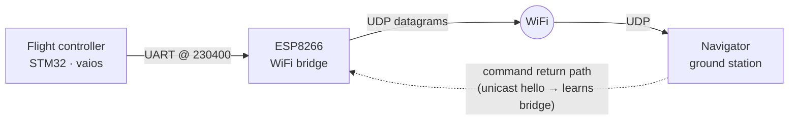
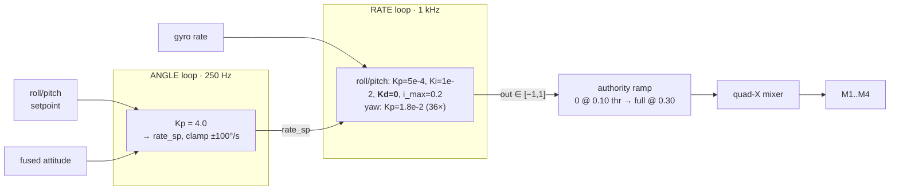
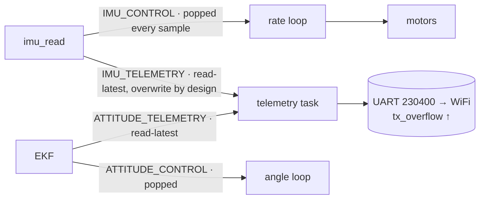

We had recorded telemetry from the flight controller before. Every one of
those logs came down a **USB cable** — and the cable was the problem. You
cannot let an airframe pivot, swing, and spin on a test rig while it's
umbilicaled to a laptop. The tether *is* the constraint.

So the first thing I changed wasn't the controller. It was the transport.
I built a **UDP/WiFi telemetry bridge** so the aircraft could talk to the
ground station with no wire attached. This post is about the first log we
captured that way: 375 seconds on a free-pivot rig, **38,292 frames, zero
CRC errors** — the first time the firmware streamed to the ground with
nothing physical holding the frame down.

It was worth cutting the cable. The log says the wire works, the kernel
works, the failsafe works, and the estimator tells the truth — and that
the **roll/pitch attitude loop shakes itself apart the moment you feed it
throttle.** None of that is visible on a live dashboard. It's visible when
you decode every frame and check it against the firmware that produced it.

Everything below is computed from that one `.bin`. The figures are
regenerated from the decoded CSVs, so each plot reads the same bytes the
analysis did.

---

## 1. The transport: why a UDP bridge, and what it costs

The recorder writes a `VREC` container — a 20-byte header then
`[t_us:u64][len:u32][bytes:len]` records, each holding a raw *inbound byte
chunk*, not a clean packet. Decoding replays every chunk through the
**generated** NavLink v2 codec — the same Python/C the firmware serializes
*from*, generated off one `dialect.json`. There is no hand-written parser
to drift out of sync with the wire. That single-source-of-truth property
is what lets me trust a decoded field enough to call it a firmware bug
later.

The link itself is now three hops instead of one:

Three design facts fall out of that diagram, and all three show up in the
log.

**The UART had to slow down.** The old wired link ran at 921600 baud. The
ESP8266 can't losslessly forward that over WiFi, so the telemetry UART
dropped to **230400** (~22 KiB/s). That's still comfortable headroom over
the ~5–8 KiB/s the firmware actually emits — *on paper*. In this session
it wasn't enough (more below).

**UDP has no duplicate suppression.** A WiFi MAC-layer retransmit whose
ACK was lost delivers the *same datagram twice*. Serial never did this.
The multi-fragment perf reports reassemble by appending chunks — and a
duplicated fragment silently inflated the task list until the reassembler
started tracking applied fragment indices and dropping repeats. That's a
bug class the cable never exposed; the cable was hiding it.

**The ground station has to find the bridge.** The bridge doesn't know the
GCS address, and broadcast over WiFi is lossy. So Navigator unicasts a
periodic *hello*; the bridge learns the GCS address from it and replies
with reliable, MAC-retried unicast. Command uplink rides the same path
back.

That's the enabling work. Now the log.

---

## 2. The whole session, at a glance

The state machine (STANDBY → ARMED → FAILSAFE, never `IN_AIR`) reached
**ARMED four times** for ~213 s total, and **never went airborne**.
Throttle stayed at or below 0.30; motors peaked at 0.69. This is a
bench-rig run on a free pivot: at rest the frame hangs to one side, and on
throttle it swings.

Two things are already legible in the overview. Every `FAILSAFE` lines up
with an RC dropout — the failsafe path fires correctly every time. And the
attitude trace (middle panel) isn't noise: those are **growing sawtooth
oscillations**, one per armed window, each ending the instant throttle is
cut. That's the headline.

---

## 3. The headline: a loop that diverges under its own feedback

Pick the longest armed window and overlay roll angle against throttle:

 — the loop is driving the motion.")

Hold throttle up and roll **builds** — from ±5° to a sustained limit cycle
near ±50°, peaking at 76°, at a dominant **~0.3 Hz**. The only thing in the
entire log that stops it is the operator pulling throttle. Three times,
once per window.

The obvious question is whether this is the *controller* or just a
pendulum swinging on the rig. It's the controller, and the phase
relationship proves it. Over the build-up, controller output and angle are
**anti-phase**: `corr(roll_out, roll_angle) = −0.81`. A passive swing
would show no such correlation with the *commanded* output. Negative
feedback that's *in phase to oppose the motion but lagging* is exactly what
sustains a limit cycle — the loop is pumping the oscillation, not damping
it.

### Why it oscillates — the control architecture

Vayu's attitude control is a textbook cascade, but the gains are the story:

The inner rate loop runs roll/pitch at **Kp = 5×10⁻⁴, Ki = 10⁻², and
Kd = 0**, with the integrator clamped at 0.2. That tuning has three
properties that compound into instability:

1. **Almost no proportional authority.** The output-vs-error slope *is* the
   P-gain, and you can read it straight off the data:

 match the firmware Kp = 5e-4 to a few percent. Yaw fans out an order of magnitude steeper; with 36× the gain it's the only axis doing real work.")

   The roll and pitch clouds barely leave the x-axis: empirical slopes of
   **0.00035 and 0.00038**, matching `Kp = 5e-4` directly. Yaw, at 36× the
   gain, spans the full ±1 (its fan-out is the integrator winding up on the
   hand-spin disturbances — more below). The asymmetry is stark: yaw is the
   only axis with meaningful authority in this log.

2. **No derivative term at all.** `Kd = 0` means there is **zero rate
   damping** in the loop. Nothing pushes back proportional to how fast the
   angle is changing — the one term whose whole job is to suppress
   oscillation is switched off.

3. **An integral-dominant loop is a lagging loop.** With P and D near zero,
   the response leans on `Ki = 10⁻²`, and an integrator contributes ~90° of
   phase lag. Against a pendulum-like plant (the rig's own ~90° of lag near
   resonance), you're approaching the 180° round-trip where negative
   feedback becomes positive. That is the classic recipe for a
   **low-frequency limit cycle** — and ~0.3 Hz is right where the rig's
   slow pivot dynamics sit.

The **authority ramp** is the trigger. To stop ground-resonance feedback,
rate output is scaled from zero at 0.10 throttle to full at 0.30. So the
effective loop gain *rises with throttle*. At idle the loop is too weak to
oscillate; as throttle crosses ~0.22–0.30 the gain climbs, the loop tips
underdamped, and it diverges — which is precisely why the oscillation
appears and grows when throttle is held up, and decays when it's pulled.
The amplitude tracks throttle with tens of seconds of hysteresis (it's a
slow build, not an instantaneous gain), which is why a naive
throttle-vs-amplitude correlation looks weak even though the mechanism is
clear.

One alternative I had to rule out: **bad loop timing**. It's clean. The
outer loop logs `outer_dt = 4.000 ms` (250 Hz) and the inner
`inner_dt = 1.000 ms` (1 kHz) with **zero variance** across all 7,450
control frames. The scheduler is keeping perfect cadence. This is a tuning
problem, not a jitter problem.

**The fix** is what the analysis points to and the next rig run will test:
add rate **Kd** for damping, raise **Kp** off the integrator, lower **Ki**
and the integral clamp — one axis at a time, re-tested on the bench before
anything flies.

### Yaw is a different animal

Yaw was rate-controlled with `yaw_rate_sp = 0` the entire session — every
bit of yaw motion is a *disturbance* (the operator hand-spinning the rig).
With 36× the roll/pitch gain, the yaw loop fights back hard: `yaw_out`
saturates past 0.9 in a fraction of armed frames, and a stretch near the
end shows alternating ±65–80°/s spins on a ~2 s period — possibly a yaw
limit cycle of its own. It gets revisited only after roll/pitch is calm;
one unstable loop at a time.

---

## 4. A free reference truth: validating the EKF against the rig

The free-pivot rig hands you something a real flight never does: a **known,
non-zero attitude**. The frame rests tilted because the pivot lets it — at
idle it hangs to one side, and under throttle it swings through 25–37°.
That isn't a finding; it's the test condition I set up. But it *is* a gift,
because it means the rig is continuously presenting the estimator a true
attitude I can check it against.

So while the drone tilts, I get a free EKF accuracy test: does the fused
attitude match the tilt the raw accelerometer implies?

The fused attitude is an **error-state EKF** (6-state: attitude error +
gyro bias) running at 250 Hz off 2 kHz IMU, decimation 8. Accelerometer
pins roll/pitch via gravity (gated when `||a|−g| > 1.5 m/s²` to reject
dynamic accel); magnetometer pins yaw; gyro bias is estimated online.

Comparing the fused total tilt to the tilt implied by the raw accel vector,
the two agree to a mean of **−2.4°** across all keyframes. The EKF
faithfully reports the rig's attitude — including the deep, fast swings of
the oscillation — so the roll/pitch fusion is trustworthy. That matters for
the next section: when I say the *controller* drove the frame into a limit
cycle, I'm leaning on an estimator I've just confirmed is telling the truth
about where the frame actually was.

(Yaw is the exception — it's pinned by the uncalibrated magnetometer, so
fused heading is not trustworthy. That's §5, and it doesn't touch
roll/pitch, which come from accel and gyro.)

---

## 5. The sensors underneath

The estimator is honest, but two of the three sensors feeding it are not
calibrated.

 is the worse one — a scale error, not vibration. Right: |mag| should be a single value in any orientation; instead it smears across 22–92 µT.")

**Gyro — good.** Bias under 0.1°/s on every axis, sub-degree noise. The one
sensor I trust outright.

**Accelerometer — +7.8% scale error.** Gravity should read 9.807 m/s² at
rest; the motors-off static samples mean **10.571**. The tell that this is
calibration and not vibration: the error is *largest with motors off*.
Vibration rectification would bias the motors-*on* figure higher, not
lower — so it's a genuine scale-factor error a six-side calibration fixes.
There's a second-order consequence too: at rest `||a|−g| ≈ 0.8`, already
over half the EKF's 1.5 m/s² accept gate, so the mis-scale makes the filter
reject good static samples and coast on gyro more than it should.

**Magnetometer — unusable.** A calibrated mag reads a near-constant field
magnitude in every orientation. This one swings **22 → 92 µT** — 140% of
its mean.

 µT — and the unequal spans are soft iron.")

The clouds are off-center (hard-iron offsets to ~25 µT) and unequal in span
(soft iron). Both corrections are missing. The consequence flows straight
into the EKF: **yaw is pinned by the magnetometer, so fused heading is not
trustworthy** in this log. Roll and pitch are unaffected — they come from
accel and gyro — which is why the tilt finding still stands. Heading-hold
or any nav use waits on an ellipsoid-fit calibration, run *with the frame
powered* so motor-current interference is captured.

---

## 6. The kernel did its job — and showed where the link didn't

It's tempting to suspect the RTOS when control misbehaves. The perf
telemetry clears it, and in doing so puts the transport story in sharp
relief.

The CPU holds a **64% median** with a third idle, the EKF uses 22% of its
4 ms budget, the heap never OOMs, and IPC logs **zero timeouts** across 3.6
million takes. Compute is not the bottleneck. But the left panel shows the
TX-buffer overflow counter climbing steadily — **612 → 2680**, ~2,068 lost
buffers — the downlink unable to drain at the offered rate.

A note before reading too much into the FIFO counters, because it's easy to
get this backwards. The same producers fan out into two sets of FIFOs, all
single-producer/single-consumer with an **overwrite** policy — but the two
sets are *consumed* completely differently:

The **control-path** FIFOs have consumers that actually *pop* every sample
at loop rate, so they drain as fast as they fill — ≤ 33% full, **zero
drops**. The flight loops are fed cleanly.

The **telemetry-path** FIFOs look alarming — pinned at 100%, "drop" counter
climbing forever — but that's **by design, not link saturation.** The
telemetry task doesn't pop these queues; it *reads the latest value in
place* and moves on. Nothing ever consumes a slot, so the only way for a
producer to insert a fresh sample is to overwrite the oldest one. A
permanently-full queue and a monotonically-rising "drop" count are exactly
what a latest-value mailbox *should* report: they measure how much faster
the producer runs than the telemetry task samples it, which is intentional
decimation-by-overwrite. It would read identically on a 10 Gbps link. So
the FIFO counters say nothing about the downlink.

What *does* measure the downlink is `tx_overflow` — and that one is real.
It counts times the UART TX buffer had no room for an outgoing byte, and it
climbed 612 → 2680: ~2,068 packets that genuinely never made it onto the
wire. *That's* where the WiFi bridge's 230400-baud ceiling shows up, and
the fix lives at the link layer — decimate the high-rate streams or add a
stream-rate control packet, not touch the kernel. The 230400 headroom that
looked ample on paper wasn't, under this stream mix — a direct, concrete
cost of the bridge to tune before the next run.

---

## 7. The telemetry was lying (a little), and that's a finding too

The hardest part of reading this log was trusting the log. Five fields are
populated wrong. Each cost me time before I confirmed it was a producer bug
and not a real signal — and each is now a fix that makes the *next* capture
worth far more:

- **Fused body rates are always 0.** The attitude message ships
  `rollspeed/pitchspeed/yawspeed` as zeros; the producer never copies them
  even though the gyro carries real rates. This is the most painful one —
  it means I can't watch the rate loop directly, which is exactly what
  tuning the oscillation needs.
- **`cpu_load` is always 0.** Real timing lives in the perf stream; this
  field just advertises a value it doesn't fill.
- **`ImuRaw.sample_time_us` is always 0.** No per-sample hardware timestamp,
  so IMU frames can only be timed by arrival — jittery, and subject to the
  link stalls above.
- **`ImuCompressed.ref_seq` is stuck at 0.** Its whole job is to bind each
  delta frame to the keyframe it was differenced against. Pinned to zero,
  the compressed IMU stream can't be reliably reconstructed.
- **Degrees vs. radians mismatch.** The control trace reports angles in
  degrees; the attitude message reports them in radians (verified at
  matched timestamps — the ratio is exactly 180/π). A consumer that assumes
  one convention mis-scales by 57×.

None of these are decode errors — the CRC was perfect. They're the
controller describing itself inaccurately, which is its own class of bug,
and the cheapest possible thing to fix before flying again.

---

## 8. What cutting the cable bought us

The aircraft never left the rig, and the log was still worth every one of
its 375 seconds. Cutting the cable turned a bench fixture into a *moving*
test rig, and the first untethered capture converted a vague "it wobbles"
into a precise, ordered work-list:

1. **Calibrate** the accel (six-side) and mag (ellipsoid, powered) — give
   the loop good data before retuning it.
2. **Fix the telemetry producers** — body rates first — so the next log is
   fully analysable.
3. **Re-tune the roll/pitch rate loop:** add Kd, raise Kp off the
   integrator, lower Ki. One axis at a time.
4. **Prove it on the bench** — a throttle-step sweep with no growing
   oscillation, a disturbance-release that settles, a yaw that returns
   cleanly — before anything tethered or low.

And tune the downlink: at 230400 over WiFi, the stream mix saturates the
link, so the high-rate streams need decimating or rate control.

The wire works. The kernel works. The failsafe works. The estimator tracks
truth. That's a real foundation — and everything else is now a bounded list
of known problems instead of a mystery. Which is exactly what a first
untethered log is for. Free flight stays off the table until the rig is
boring.
