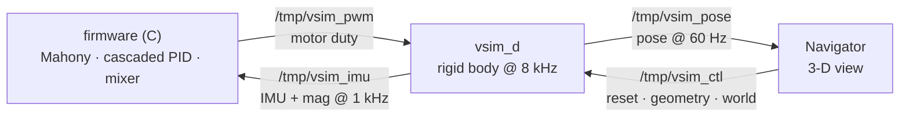

A real multirotor is a rigid body. It obeys Newton and Euler: forces move its centre of mass, torques tumble it about a full inertia tensor, and gravity is always on. The firmware that flies it lives in a different universe — one that counts in microseconds, integer ticks, and unit quaternions, and that will happily compute its way straight into a NaN if you let it.

**`vsim_d`** is the ~2,500-line daemon where those two universes have to agree, eight thousand times a second, or the aircraft "flies" into a wall of not-a-number. It's the simulator that the same binary which runs on our STM32 flight controller talks to instead of real sensors and motors. That makes it the plant against which the [autotuner](/engineering/teaching-a-drone-to-tune-itself/) runs its experiments.

It has two halves. The first half is *building the body*: turning a CAD mesh into the mass, centre of mass, and inertia tensor that the dynamics need — a problem that lives at the boundary of computational geometry and mechanics. The second half is *flying it*: integrating that body in real time without the numerics or the systems underneath lying to you. The war stories are all the same shape — the physics was correct, and something on the other side of the seam betrayed it anyway.

---

## 1. Architecture: one body, three rates, four pipes

`vsim_d` is a single process with one job: be the physical world. The firmware runs *in* the Navigator ground station (or as a standalone host binary); the physics runs out here. They talk over four named pipes.

The decisive point — the one that makes any of this worth doing — is that the firmware is the **exact binary that flies the vehicle**. On hardware it reads a BMX160 over our HAL; in SITL it reads `/tmp/vsim_imu`. Nothing in the estimator or control path knows the difference. So the simulator isn't a toy that approximates the controller's world; it *is* the controller's world, swapped at the sensor boundary.

Inside, the daemon runs one thread at three rates (`main.cpp:43`):

| Rate | What happens |
|------|--------------|
| **8 kHz** | RK4 physics step; drain the PWM pipe; drain the control pipe |
| **1 kHz** | synthesize and emit one IMU frame (this *is* the firmware loop rate) |
| **60 Hz** | emit one pose frame for the renderer |

The 8 kHz physics rate is finer than the 1 kHz sample rate on purpose: the daemon takes eight RK4 sub-steps per IMU sample. You integrate fast — for fidelity and to keep fast contacts from tunnelling — while you *sample* at a sane, jitter-free rate.

One subtlety hides in that split, and it's the first place mechanics and numerics negotiate. The motor wrench — force and torque — is held **constant across all four RK4 sub-evaluations** of a step (`physics_core.cpp:67`). Physically the motors are continuous; numerically we zero-order-hold the forcing across the step. That's correct to first order and standard for environment forcing, but it's a *choice*, and it's the kind of choice this whole post is about: where you let the discrete approximation diverge from the continuous truth, and how much.

---

# Pillar I — Building the plant

## 2. From mesh to inertia: where CAD meets the integral

Here is a claim the [autotuner post](/engineering/teaching-a-drone-to-tune-itself/) leans on without proving: *we tune the real S500, not a generic quad.* The gains a controller needs scale with the airframe's inertia $I$ and its arm lengths, because the torque that turns it is $\boldsymbol\tau \approx I\dot{\boldsymbol\omega}$. Feed the simulator a generic quad and the tune you get back is a number you can only screenshot. So the simulator has to integrate *this* aircraft's actual inertia tensor — and that tensor has to come from somewhere.

It comes from the mesh. The vehicle is an STL/glTF triangle soup; we want its mass, centre of mass, and full $3\times3$ inertia tensor. The naive route — voxelize and sum — is slow and inexact. The right route is a small piece of computational geometry: **Eberly's polyhedral mass-properties integral** (the refinement of Mirtich's method), which turns volume integrals into a sum over triangles via the divergence theorem.

The trick is that every mass property is a volume integral of a monomial:

$$V=\!\int_V\! 1\,dV,\quad m\bar{\mathbf x}=\rho\!\int_V\!\mathbf x\,dV,\quad I_{xx}=\rho\!\int_V\!(y^2+z^2)\,dV,\quad I_{xy}=-\rho\!\int_V\! xy\,dV,\ \dots$$

and the divergence theorem collapses each of those $\iiint_V$ into a flux $\oiint_{\partial V}$ over the boundary — which, for a triangulated surface, is just a sum of closed-form per-triangle contributions. The implementation (`MassProperties.cpp`) accumulates ten integrals — $\{1,\,x,y,z,\,x^2,y^2,z^2,\,xy,yz,zx\}$ — in a single pass over the triangles, using Eberly's clever subexpression factoring so each triangle costs a handful of multiplies. Then:

$$V=\textstyle\int 1,\qquad \bar{\mathbf x}=\frac1V\Big(\!\int x,\int y,\int z\Big),$$
$$I_{xx}=\textstyle\int y^2+\int z^2,\quad I_{xy}=-\!\int xy,\quad\dots\ \text{(about the origin)}$$

and a **parallel-axis shift** moves the tensor from the origin to the centre of mass, which is the only frame the dynamics may use:

$$I^{\text{CoM}}_{xx}=I^{O}_{xx}-V\,(\bar y^2+\bar z^2),\qquad I^{\text{CoM}}_{xy}=I^{O}_{xy}+V\,\bar x\bar y.$$

Two details separate a correct implementation from a plausible one. First, **winding**: an inside-out mesh flips the sign of the signed volume and every integral with it; the code detects $V<0$ and negates the lot (`MassProperties.cpp:82`). Second, **the products of inertia carry a negative sign** ($I_{xy}=-\int xy$) — they are the off-diagonal tensor entries, and a model that quietly assumes a diagonal tensor throws them away. That matters more than it sounds, and the next section is why.

Does it work? Here is the algorithm, re-implemented from the daemon's own code, run against shapes with known closed-form tensors:

 against the closed-form tensor (horizontal), for a box, a UV-sphere, and a 45°-rotated box. Every component lands on the y = x line; the rotated box's nonzero product of inertia is exactly the term a diagonal model discards.")

The numbers check out against the closed forms. A tessellated box and a UV-sphere recover their analytic tensors to a fraction of a percent, and the rotated box matches $R\,I_0R^\mathsf{T}$ exactly:

| solid | analytic form | max relative error |
|-------|---------------|--------------------|
| box | $\tfrac{m}{12}\,\text{diag}(b^2{+}c^2,\,a^2{+}c^2,\,a^2{+}b^2)$ | **0.00 %** |
| sphere (UV-tessellated) | $\tfrac25 m r^2\,\mathbf{1}$ | **0.15 %** |
| box @ 45° | $R\,I_0\,R^\mathsf{T}$ (with $I_{xy}\neq0$) | **0.00 %** |

The sphere's residual is its triangulation, not the integral. The rotated box is the interesting case: its principal axes no longer align with the body frame, so a real product of inertia $I_{xy}$ appears — and the integral catches it. That off-diagonal term is precisely what a naive diagonal-inertia simulator silently drops.

## 3. Newton–Euler about that centre of mass

The tensor from §2 feeds the rotational half of the equations of motion. `vsim_d` integrates a single rigid body whose state is position, world velocity, attitude quaternion, and body angular rate; the derivative (`physics_core.cpp:22`) is the textbook Newton–Euler set:

$$\dot{\mathbf p}=\mathbf v_w,\qquad \dot{\mathbf v}_w=\tfrac1m\,R(\mathbf q)\,\mathbf F_b-\tfrac{c}{m}\big(\mathbf v_w-\mathbf v_{\text{wind}}\big)+\mathbf g,$$
$$\dot{\mathbf q}=\tfrac12\,\mathbf q\otimes(0,\boldsymbol\omega_b),\qquad I\dot{\boldsymbol\omega}_b=\boldsymbol\tau_b-\underbrace{\boldsymbol\omega_b\times(I\boldsymbol\omega_b)}_{\text{gyroscopic}}-\,c_\omega\boldsymbol\omega_b.$$

The translational line is unremarkable — rotate the body-frame thrust into the world, divide by mass, add gravity (NED, so $+z$ is down), subtract drag. (That $\mathbf v_w-\mathbf v_{\text{wind}}$ is the one hook wind hangs on; §8.)

The rotational line is where the full tensor earns its keep. The term $\boldsymbol\omega_b\times(I\boldsymbol\omega_b)$ is the **gyroscopic coupling** — the reason a tumbling asymmetric body nutates, exchanging angular velocity between axes even with zero applied torque. If $I$ is diagonal *and* the body spins about a principal axis, the term vanishes and you'd never miss it. For a real airframe with products of inertia, tumbling off-axis after a hard input, it's a genuine torque that a naive diagonal model never produces. Getting §2's off-diagonal terms right is what makes this term right.

One small piece of craft: $I^{-1}$ is needed four times per 8 kHz step (once per RK4 stage), so the daemon inverts the tensor *once* when geometry changes and caches it (`physics_core.h:27`). The inverse itself (`vsim_math.h:149`) guards against a singular tensor by returning identity rather than a matrix of infinities — a wildly-wrong inertia is a config error, but it must not become a NaN that poisons the integrator. Which is foreshadowing.

---

# Pillar II — Flying it

## 4. Integrating a quaternion (the first thing that lies)

The integrator is classic RK4 on all four state variables at once (`physics_core.cpp:67`). For position, velocity, and angular rate that's unimpeachable. For the quaternion it tells a small, persistent lie.

The attitude kinematics $\dot{\mathbf q}=\tfrac12\,\mathbf q\otimes(0,\boldsymbol\omega)$ have a property RK4 does not preserve: they keep $\|\mathbf q\|=1$. The true flow lives on the unit sphere in $\mathbb{R}^4$; a unit quaternion is a rotation, a non-unit one is a rotation *and a scaling*. But RK4 advances $\mathbf q$ by a weighted sum of derivative evaluations and then adds it on — a step along the tangent, which lands slightly off the sphere. Apply that drifted quaternion through `rotatedVector` and it doesn't just rotate the thrust and gravity vectors, it rescales them. The fix is one line at the end of every step (`physics_core.cpp:85`): renormalize.

How much does it actually drift? I ran the daemon's exact update — constant body rate, RK4, with and without the renormalize — at several step sizes:

The honest answer: at the daemon's 8 kHz the per-step drift is near machine-zero, and even at 50 Hz it's $\sim10^{-7}$ over twenty minutes. This is not a dramatic bug. It's a *secular* one — one-directional, never self-correcting, scaling with step size — and that's exactly why you renormalize anyway: it's one square root per step of insurance against a quantity that otherwise only ever walks away from the truth, silently scaling every force you rotate through it.

> **An aside on honesty in comments.** The motor model's first-order spin-up filter (`motor_model.cpp`) had its smoothing coefficient labelled "exact." It's backward-Euler — a perfectly good discretization, but not the exact one, and the comment now says so. RK4 itself is the larger version of the same admission: it is *not* symplectic, so over a long undamped tumble it would slowly drift the rotational energy it has no mechanism to conserve. For a damped, driven, short-horizon flight sim that's a fine trade, but it's a trade you should be able to name, not one you discover.

## 5. What the accelerometer actually feels

An accelerometer does not measure acceleration. It measures **specific force** — the non-gravitational force per unit mass — which is why one sitting still on your desk reads $9.81\,\text{m/s}^2$ upward, not zero. The sensor model has to reproduce that or the estimator never converges.

The daemon computes it exactly (`sensor_models.cpp:48`): specific force in the world is $\mathbf a_{\text{spec}}^w=\mathbf a^w-\mathbf g$, then rotate into the body frame with the conjugate quaternion:

$$\mathbf a_{\text{spec}}^b=R^\mathsf{T}\big(\mathbf a^w-\mathbf g\big).$$

At rest $\mathbf a^w=0$, so a level airframe reads $R^\mathsf{T}(0,0,-g)=(0,0,-g)$ in body frame — exactly the $-g$ on the body-down axis the BMX160 driver expects. Now watch what happens when the craft tilts while hovering in place:

; under tilt at zero ground speed its lateral axis feels −g·sin φ ≈ ±3.35 m/s² — the thrust-tilt corruption the estimator must survive.")

The body is hovering — zero ground speed, zero world acceleration — and yet the moment it rolls 20°, the accelerometer's lateral axis swings to $-g\sin\phi\approx 3.35\,\text{m/s}^2$. The sensor *feels gravity sideways*. This is the **thrust-tilt corruption**, and it's the physical reason a low-margin attitude loop can run away: the estimator sees that lateral specific force, the Mahony filter lags it, and a hot controller chases a phantom. (It's why the tuning rig grew a soft tether instead of a hard pin — so the simulated accel sees this corruption rather than an idealized, drift-free attitude. That story is in the [autotuner post](/engineering/teaching-a-drone-to-tune-itself/); here the point is just that the model produces the corruption faithfully, because it computes specific force and not acceleration.)

### Determinism is a contract, and it leaks in three places

The autotuner scores gains by running rollouts and comparing costs. That only works if the same gains produce the same cost — if the noise is *reproducible*. The daemon seeds a `std::mt19937_64` from the reset message and expects determinism to follow. It doesn't follow for free; it leaked twice.

The first leak is subtle enough that it's almost folklore: `std::normal_distribution` generates values in pairs (Box–Muller) and **caches the second one between calls**. Reseed the engine and the cached value survives, so the stream is no longer a pure function of the seed. You have to `.reset()` the distribution too (`sensor_models.cpp:11`). The second leak is the bias random walk: each sensor's bias is an accumulator that drifts under a clamped random walk, and a "reset" that reseeds the RNG but *doesn't zero the accumulator* starts the next run from wherever the last one happened to drift. Same seed, different starting bias, divergent runs.

Runs A and B share a seed and a zeroed accumulator: bit-identical, the whole way. Run B′ shares the seed but inherits a drifted bias, and it rides that offset forever — same random *increments*, different absolute trajectory. The fix is two lines (clear the cache, zero the accumulators); the lesson is that determinism has three leaks — the seed, the distribution's hidden state, and every accumulator you forgot to reset — and an A/B search will quietly lie to you until all three are plugged. (Wind turbulence, §8, gets its *own* RNG salted off the master seed for exactly this reason: enabling wind must not perturb the sensor-noise sequence the tuner's baseline depends on.)

## 6. Contact without a physics engine

`vsim_d` has no Bullet, no PhysX — just enough rigid-body contact to make landings, crashes, and tip-overs honest. The model is impulse-based and deliberately small, and its one good idea is to refuse to treat the drone as a point.

The airframe is four contact points — a footprint at the arm tips, not a dot at the centre of mass (`physics_core.cpp:164`). When a point penetrates the ground, an obstacle, or the imported world mesh, the daemon applies a normal impulse with full rotational coupling. Because the contact is *off* the centre of mass, it produces a torque $\boldsymbol\tau=\mathbf r\times\mathbf J$, and the airframe catches an edge and tips instead of sliding flat. The impulse magnitude uses the proper effective mass along the contact normal,

$$k_{\text{eff}}=\frac1m+\mathbf n\cdot\big[\big(I^{-1}(\mathbf r\times\mathbf n)\big)\times\mathbf r\big],\qquad j=-\frac{(1+e)\,v_n}{k_{\text{eff}}},$$

then adds capped Coulomb friction along the tangent and lifts the body out of penetration by the deepest of the four points — a shared position push-out so the primitive-obstacle path and the BVH world-mesh path (`resolveWorldMesh`) resolve into one correction instead of fighting. A resting airframe gets one more touch: a righting torque built from the cross product of its body-up axis with world-up,

$$\boldsymbol\tau_{\text{right}}\propto\hat{\mathbf u}_{\text{body}}\times\hat{\mathbf u}_{\text{world}},\qquad \|\cdot\|\sim\sin(\text{tilt}),$$

so a quad that comes to rest on a tilted edge topples flat, the way a real one can't balance on an arm (`physics_core.cpp:323`). The ground-friction damping along the tangent is scaled per unit time, so the footprint sheds lateral velocity at the same rate no matter how finely the step is subdivided.

## 7. The integrator that wouldn't die

Everything above assumes the numbers stay finite. They don't, because the firmware on the other end of the PWM pipe is a controller under active development, and a diverged controller is a number cannon.

The failure cascade is short and total. A too-hot gain drives the angular rate up; the rate overflows `float` to infinity; the gyroscopic term $\boldsymbol\omega\times(I\boldsymbol\omega)$ computes $\infty-\infty=$ NaN; and from that step on, *every* downstream consumer — IMU synthesis, the estimator inside the firmware, the renderer — is poisoned, permanently, because NaN is contagious under every arithmetic operation. One bad step and the simulator is a corpse that still paces frames.

 returns NaN.")

The defense is two-layered, and the first layer has a trap in it. The obvious guard is to clamp the motor command to $[0,1]$ — but **`std::clamp(NaN, lo, hi)` returns NaN** (it's a chain of comparisons, and every comparison with NaN is false, so the value falls through unchanged). Clamping cannot remove a NaN; it can only bound a number that's already finite. So the daemon rejects non-finite motor duty *explicitly* at ingest (`main.cpp:210`) — `isfinite` or it's zero — and, as a last resort inside the integrator, `sanitize()` checks the whole state for non-finite values after every step and resets to a sane resting pose if it finds any, then clamps runaway rates to physically absurd-but-finite bounds (`physics_core.cpp:274`). The clamp is the cheap everyday guard; the finite-check is the one that actually saves you.

There's a systems-shaped sibling to this bug, too. Two `vsim_d` processes writing the same `/tmp/vsim_imu` — say, a stale daemon orphaned by a crashed ground station — interleave their frames into torn garbage, and torn IMU bytes decode to NaN just as surely as a divergence does. So the daemon takes an `flock` on a pidfile at startup and, if a previous instance holds it, terminates that instance before producing a single frame (`main.cpp:72`). The defensive posture is the same at every layer: a NaN is easier to *refuse to create* than to clean up after.

## 8. Wind, and a filter that's right by construction

Not every section is a war story. The one fidelity feature that's fully landed is wind, and it's a small pleasure of a thing because it's correct by construction.

The physics change is a single substitution (§3): drag acts on the air-relative velocity $\mathbf v_{\text{rel}}=\mathbf v_w-\mathbf v_{\text{wind}}$, so a craft hovering in a steady wind is *pushed* — the drag no longer zeroes at zero ground speed (`physics_core.cpp:32`). Steady wind is that one line. The interesting part is turbulence, modelled as a discrete first-order Dryden shaping filter driven by white noise (`wind_model.h`):

$$v_{\text{turb}}[k]=\alpha\,v_{\text{turb}}[k-1]+\sigma\sqrt{1-\alpha^2}\;\mathcal N(0,1),\qquad \alpha=e^{-\Delta t/\tau}.$$

The $\sqrt{1-\alpha^2}$ is the whole trick. Without it, the filter's steady-state RMS would depend on the step size, and your "turbulence intensity" knob would mean something different at 1 kHz than at 8 kHz. With it, the steady-state variance is exactly $\sigma^2$ for *any* $\Delta t$ — the knob is calibrated by construction:

, all on the ideal y = x line — the √(1−α²) factor makes the intensity knob step-size-independent — beside a sample band-limited trace at σ = 2, τ = 1 s.")

The same dt-independence, as exact numbers — one sweep at three different $\Delta t$:

| commanded $\sigma$ | RMS @ 1 ms | RMS @ 5 ms | RMS @ 20 ms |
|---|---|---|---|
| 0.5 | 0.511 | 0.485 | 0.490 |
| 1.0 | 0.921 | 0.971 | 0.996 |
| 2.0 | 2.030 | 2.134 | 1.917 |
| 3.0 | 3.001 | 3.161 | 3.056 |
| 4.0 | 3.603 | 4.091 | 4.349 |

Three step sizes, one line. It's an easy property to take for granted — *of course* the intensity knob means intensity — and exactly the one a naive recurrence betrays quietly if you don't insist on it. The turbulence filter also runs on its own RNG, salted off the master seed with the golden ratio (`wind_model.h:40`), so the whole stochastic world stays reproducible run-to-run without any one source perturbing another.

## 9. Real time is a physics constraint too

A last, short one, because it's the constraint that ties the rest together. `vsim_d` is paced by `clock_nanosleep` to wall-clock time, because the firmware on the other end is a real-time loop that expects its IMU frames on a real-time cadence. And when the host can't keep up — a scheduling hiccup, a fat GC pause in the renderer — the daemon does something that looks lazy and is exactly right: it **drops the lost time and resyncs**, rather than running a burst of catch-up steps (`main.cpp:504`).

That's not sloppiness; it's correctness. A catch-up burst would hand the firmware a flurry of IMU frames faster than real time, desyncing the loop it's supposed to be pacing — worse than a dropped frame. A simulator that paces another real-time system has to treat wall-clock time as a hard constraint it may fall behind on but must never fake. The number of RK4 sub-steps per sample, meanwhile, is the knob for the *other* direction: more sub-steps buy finer integration and less collision tunnelling at the same sample rate — fidelity you can dial up without touching the cadence the firmware sees.

---

## 10. What I'd tell my past self

- **Build the body before you fly it.** The inertia tensor is not a parameter you guess — it's an integral over the mesh, products of inertia and all. Get §2 right and the gyroscopic term, the gains, and the whole transfer to hardware get right for free. Get it wrong and you're tuning a different aircraft.
- **A diagonal inertia tensor lies about exactly the airframes worth simulating.** The off-diagonal terms are small until the body tumbles off-axis, which is precisely when you needed them.
- **The accelerometer measures specific force, not acceleration.** $-g$ at rest, gravity-sideways under tilt. Get the sign and the frame right or the estimator never converges — and the bug looks like a controller problem, not a sensor-model one.
- **Correct physics on a non-symplectic integrator still drifts.** Renormalize the quaternion every step; it's one square root against a quantity that only ever walks away. And know which conserved quantity your integrator isn't conserving.
- **`clamp(NaN)` returns NaN.** Clamping bounds a number; it cannot remove a not-a-number. Reject non-finite values at every ingest, and keep a finite-check sanitizer as the last line — the clamp is not it.
- **Determinism has three leaks:** the seed, the distribution's hidden cache, and every accumulator you forgot to reset. An A/B search will lie to you with a straight face until all three are plugged.
- **Frame-rate-dependent physics is a bug even when it feels fine** — and a known bug with a comment beats an unknown improvement slipped in under a refactor.

The thread running through all of it: a simulator is trustworthy not because its equations are elegant but because every seam between the mechanics and the machine — mesh to tensor, continuous to discrete, finite to NaN, sim-time to wall-clock — was made to stop lying. Writing the equations of motion is one half of the job; making sure the machine actually solves *those* equations and not a corrupted shadow of them is the other. You need both hats, and the bugs live in the gap between them.

Which is, I suppose, the usual shape of engineering.

---

*Vayu is an in-house flight stack: STM32 firmware on a custom HAL, a Qt6 ground station, and the `vsim_d` physics daemon (`tools/vsim/`). The mass-properties integral lives ground-station-side (`software/src/vsim/MassProperties.cpp`) and is pushed to the daemon over the control pipe. Every figure in this post is computed by a small harness that mirrors the daemon's own algorithms — the Eberly integral, the RK4 quaternion update, the bias random walk, the Dryden filter. Each is reproducible directly from the equations above.*
