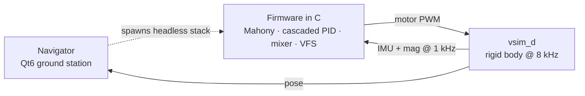
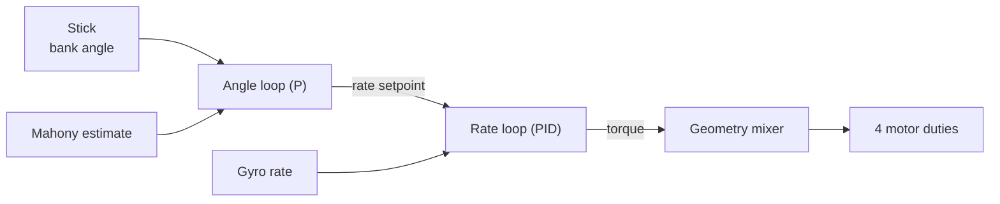

Tuning the attitude controller of a multirotor by hand is a special kind of tedium. You nudge a gain, arm, fly, watch it wobble, disarm, nudge again. Every change is a context switch, every flight is a risk, and the "feel" you're chasing is hard to quantify. On **Vayu** — our from-scratch flight stack (C firmware, a Qt ground station called *Navigator*, and a software-in-the-loop physics daemon `vsim_d`) — I wanted the loop closed: let the aircraft fly its own experiments and search the gain space itself.

This post walks through how we built that: the plant model, the cost function, the eight search algorithms we pitted against each other, and — more interestingly — the two failure modes that *looked* solved but weren't. The autotuner now reliably produces a flyable tune in a couple of minutes, but getting there meant discovering that a "good" number on a dashboard can hide a controller that's about to shake itself apart.

---

## 1. System architecture

Vayu is three pieces that share one contract:

- **Firmware** — the flight code in C: a Mahony attitude estimator, the cascaded PID controller, the geometry-derived mixer, the NavLink comms protocol, and a small virtual file system (VFS) that persists the tune. The decisive design choice is that **this is the exact same binary that runs on the vehicle.** On hardware it talks to a real BMX160 IMU and the ESCs through our HAL (NavHAL) on an STM32; in SITL it's compiled as a host process that talks to the simulator instead — nothing in the control or estimation path knows the difference.
- **`vsim_d`** — a standalone physics daemon. It integrates rigid-body dynamics at 8 kHz and synthesizes IMU + magnetometer samples at 1 kHz with calibrated sensor noise, swapping in for the real sensors and ESCs. Firmware and daemon exchange three streams over named pipes: **motor PWM** down, **IMU frames** up, and a **pose** stream out for visualization, plus a control channel for configuration (geometry, world, rates).
- **Navigator** — the Qt6 ground station. It speaks NavLink to the firmware (telemetry up, commands down), renders the live pose stream in a 3-D view, and launches the autotuner. For interactive flying it hosts the firmware *in-process* (`vayu_sitl_core`); for tuning it spawns an isolated stack so the search can't disturb the live session.

The autotuner, then, isn't a separate simulator — it drives this same stack headless: its own `vsim_d` + firmware host on a private set of pipes, excited over a virtual RC link, read back through the firmware's own telemetry.

### The control loop

Inside the firmware, attitude is the standard cascaded PID:

- The **outer (angle) loop** takes a commanded bank angle from the stick and the estimated attitude (from a Mahony filter fusing gyro + accel, with mag-fused yaw), and produces a desired body **rate**.
- The **inner (rate) loop** takes that rate setpoint and the measured gyro rate, and produces a per-axis control effort.
- A **geometry-derived mixer** allocates the wrench command to four motor duties. Crucially, the mix signs come from the actual motor layout, so a Y-mirrored airframe like our S500 doesn't invert a control axis:

$$\text{out}_i \;=\; \text{thr} \;+\; \text{roll}\cdot(-\operatorname{sign} y_i) \;+\; \text{pitch}\cdot(\operatorname{sign} x_i) \;+\; \text{yaw}\cdot\text{spin}_i$$

where $(x_i, y_i)$ is the body position of motor $i$, and $\text{spin}_i \in \{+1, -1\}$ its rotation direction.

Each inner loop is a PID on the rate error $e = \omega_{\text{sp}} - \omega$, with derivative-on-measurement and a low-pass on the D term:

$$\text{out} \;=\; \underbrace{K_p\,e}_{P} \;+\; \underbrace{\textstyle\int K_i\,e\,dt}_{I,\ \text{clamped}} \;+\; \underbrace{\operatorname{LPF}\!\big(-K_d\,\tfrac{d\,\omega}{dt}\big)}_{D}$$

That gives the controller **13 gains** — per-axis $K_p, K_i, K_d$ for the rate loop plus the angle-loop $K_p$, and an optional gyro low-pass — but roll and pitch are tuned symmetrically, so the search space is the 5-vector $(\text{rate}_{kp}, \text{rate}_{ki}, \text{rate}_{kd}, \text{angle}_{kp}, \text{gyro}_{\text{lpf}})$, or 9 with the yaw rate loop. The signal the tuner scores is the firmware's own control telemetry: setpoint, measured, and output for every axis, 18 floats per packet.

### Why it's a control problem, not curve-fitting

The torque that turns the airframe is differential thrust through the rigid-body dynamics $\tau = I\dot{\omega} + \omega \times (I\omega)$, so to first order $\tau \approx I\,\dot{\omega}$ about each axis. Two consequences set the whole tuning problem:

- **Gains scale with the airframe.** Larger inertia $I$ or shorter arms — smaller $|x_i|, |y_i|$ — need *more* gain for the same response — which is exactly why the tuner must run against the *real* geometry, not a generic quad.
- **There's a hard stability ceiling.** The loop has transport delay $T_d$ (gyro filtering → scheduling → ESC/motor spin-up → rotation → sensor). By the Nyquist/phase-margin argument, a proportional loop with delay is stable only up to a gain set by where the open loop hits −180°; more delay (or more filtering, which *adds* delay) lowers the achievable $K_p$. The gains are bounded by stability margin, not by tracking ambition — so this is a constrained control problem, and a search has to respect that edge.

### We tune the *real* airframe — not a generic quad

That first consequence — gains scale with $I$ and the arm lengths $|x_i|, |y_i|$ — is what keeps this from being "tuning a video game." Before a run, the autotuner exports the vehicle's actual definition (mass, the full $3\times3$ inertia tensor, and each rotor's body position $\mathbf{p}_i$, spin direction, and thrust/torque constants) and pushes it into the simulator via `VSIM_CTL_SET_GEOMETRY` — *and* the same numbers drive the firmware's mixer. So `vsim_d` isn't integrating some default airframe: it's integrating **our S500**, with its measured mass and inertia, and the firmware is mixing for that exact motor layout.

Because the plant the search optimizes is parameterized by the real frame, the gains that come out are **calibrated to this airframe's physics**, not generic placeholders. A 5″ freestyle quad and a 10″ cinelifter would land on wildly different numbers from the *same* search — and that's correct, because their inertias and arms differ by an order of magnitude. The implication is the one that matters: the SITL tune is a genuine, physics-anchored **starting point for the real vehicle**, not a curiosity that lives only in the sim. It collapses the dangerous part of hardware tuning — the first arm-and-hover on untested gains — into something that's already in the right basin.

To be clear about the boundary (more in §7): the *geometry* is real, but the sensor noise, the motor spin-up model, and the absence of aerodynamics are still approximations. Importing the frame gets the **inertial and allocation physics** right, which is the dominant term for attitude gains; what remains for hardware is calibration against real noise and a real ESC/prop response. "Closer," not "done" — but the geometry import is the bridge that makes it closer at all.

> **A war story before we even start.** Early runs diverged with an absurd cost (~10⁶) that I chased for hours across the estimator and mixer. The real culprit was the **control FIFO**: its `poll()` was *latest-wins* (correct for streaming pose data) but it was also carrying distinct one-shot commands. At startup the autotuner fires `rates → geometry → world` as a burst, and latest-wins silently **dropped the geometry message** — so the sim flew the *default* (non-S500) motor layout while the firmware mixed for the S500. One inverted roll axis, instant divergence. The fix was a lossless `pollNext()` for the ctl channel. Lesson: *a transport that's right for telemetry can be catastrophically wrong for commands.*

---

## 2. The problem, formally

Let $\theta \in \mathbb{R}^n$ be the gain vector. Define a **rollout** $R(\theta)$: reset the simulator to a known state, apply $\theta$, excite the vehicle, record the telemetry, and reduce it to a scalar **cost** $J(\theta)$. We want

$$\theta^{*} \;=\; \operatorname*{arg\,min}_{\theta}\; J(\theta) \qquad \text{subject to}\quad \theta_{\text{lo}} \le \theta \le \theta_{\text{hi}}.$$

Three properties of $J$ shape every decision that follows:

1. **Black-box.** $J$ is only available by *running the simulator* — there is no closed form and no analytic gradient $\nabla J$. Anything here calling itself "gradient descent" uses an *estimated* gradient.
2. **Noisy.** $J(\theta)$ is stochastic: IMU noise, real-time scheduling jitter across the multi-process FIFO loop, and genuinely chaotic limit cycles near the stability edge. The same $\theta$ scored twice differs — we saw a seed evaluate to 39.5 and 78 in the *same run*.
3. **Expensive.** Each rollout runs in **wall-clock real time** (~5–7 s; `vsim_d` is paced to the IMU rate). A 30-rollout budget is 3–4 minutes, so sample-efficiency matters.

### The cost function

Per excited axis, from the `(setpoint, measured, output)` traces over a step-doublet window:

$$J_{\text{axis}} \;=\; \underbrace{\text{IAE}}_{\text{tracking}} \;+\; \underbrace{3\cdot\text{overshoot}}_{\text{peak}} \;+\; \underbrace{25\cdot\max\!\big(0,\; \text{chatter}-0.04\big)}_{\text{steady chatter (dead-zone)}}$$

- **IAE** $= \frac{1}{N}\sum_k \lvert \text{sp}_k - \text{meas}_k\rvert$ — mean absolute tracking error over the window [deg], the dominant term.
- **overshoot** $= \big(\max_k\lvert\text{meas}_k\rvert - \text{target}\big)/\text{target}$, normalized.
- **chatter** $= \frac{1}{N}\sum_k \lvert \text{out}_k - \text{out}_{k-1}\rvert$ — the mean step-to-step swing of the controller output, a proxy for motor buzz. The **dead-zone** is the key design choice: a *linear* chatter weight makes the optimizer retreat to do-nothing (low gain → low chatter → sluggish), while *no* chatter term lets it pick twitchy gains that track but vibrate. The dead-zone (free below $0.04$, punished hard above) finds the responsiveness-vs-buzz **knee** — push gains up until they *start* to chatter, then stop.

A **divergence guard** returns a large penalty of $10^6$ for any axis past ±80° or NaN, keeping the search inside the stable region; the total cost sums the excited axes. A starved telemetry window is distinguished from a real flip and triggers a retry rather than a phantom divergence.

---

## 3. The algorithms

We implemented eight optimizers behind a common `Evaluator` interface so they share the rollout machinery and a global best. They span the classic gradient-free spectrum:

| Optimizer | Idea | Character |
|---|---|---|
| **random** | Uniform sampling over the box, seeded with the hand-gains. | Baseline; surprisingly competitive on a noisy objective. |
| **spsa** | Simultaneous Perturbation Stochastic Approximation — 2 evals/step estimate the whole gradient by perturbing all params at once. | Fast, the default; can fall into a degenerate min-gain basin on small budgets. |
| **fdgd** | Central finite-difference gradient descent — the textbook gradient, 2·N evals per step. | Honest but expensive; struggles with noise. |
| **coordinate** | Pattern search: probe ± along each axis, accept the best move, shrink the step when a sweep stalls. | Robust, local; gets stuck near the seed. |
| **nelder-mead** | Downhill simplex (reflect/expand/contract/shrink), with restarts when it collapses. | Good on smooth low-dim problems; the noisy cost confuses it. |
| **structured** | Tune **one gain at a time**, in the order a human would — `rate_kp → rate_kd → rate_ki → angle_kp` — line-searching each to its cost knee. | The "analytical" method; interpretable and reliable. |
| **hybrid** | Coarse random exploration to find a basin, then SPSA local refinement. | Global+local; consistently strong. |
| **portfolio** | Split the budget across SPSA + Nelder-Mead + coordinate, keep the global best. | Diversified hedge against any one method failing. |

#### The gradient methods, in math

Since $J$ has no analytic gradient, the descent methods *estimate* it. The literal one, **FDGD**, uses central differences along each axis — $2n$ evaluations per step:

$$\hat{g}_i = \frac{J(\theta + h\,e_i) - J(\theta - h\,e_i)}{2h}, \qquad \theta \leftarrow \operatorname{clamp}(\theta - \eta\,\hat{g}).$$

It's honest but the *most* noise-sensitive method here: each $\hat g_i$ is a difference of two noisy numbers divided by a small $h$, so noise is amplified by $1/h$.

**SPSA** (Spall, 1992) estimates the *whole* gradient with **two** evaluations regardless of dimension, by perturbing all parameters at once along a random Bernoulli sign vector $\Delta_k$ with i.i.d. entries $\Delta_{k,i} = \pm 1$:

$$\hat{g}_{k,i} = \frac{J(\theta_k + c_k\Delta_k) - J(\theta_k - c_k\Delta_k)}{2\,c_k\,\Delta_{k,i}}, \qquad \theta_{k+1} = \theta_k - a_k\,\hat{g}_k,$$

with the standard decaying gain schedules — the exponents $\alpha = 0.602,\ \gamma = 0.101$ are asymptotically optimal:

$$a_k = \frac{a}{(k+1+A)^{\alpha}}, \qquad c_k = \frac{c}{(k+1)^{\gamma}}.$$

Any single $\hat g_k$ looks like a *wrong* one-component estimate, but its **expectation aligns with the true gradient** (the cross terms vanish because the $\Delta_i$ are independent and zero-mean), so it's a valid stochastic-gradient step — and the decaying $c_k$ averages noise out over iterations. Two evals/step independent of $n$ makes it our default. **Nelder–Mead** instead crawls a simplex of $n+1$ vertices downhill by reflect $(\alpha\!=\!1)$ / expand $(\gamma\!=\!2)$ / contract $(\rho\!=\!0.5)$ / shrink $(\sigma\!=\!0.5)$ moves — elegant on smooth surfaces, but a fluke "best" vertex under noise distorts the simplex, so we restart it when it collapses.

A `--compare` mode runs them all on equal budgets. On a yaw-inclusive, budget-20 shoot-out:

The exploratory methods (**hybrid**, **portfolio**) reliably find the good basin; the pure-local methods (**coordinate**, **nelder-mead**) get stuck near the seed. SPSA is the sweet spot of speed and quality when you don't need the absolute best.

### Why "structured" became my favorite

The black-box optimizers kept doing something subtly wrong: they'd push `rate_kp` past the point where the inner loop limit-cycles, because the noisy cost couldn't cleanly separate "raise `angle_kp` (good, responsive)" from "raise `rate_kp` (bad, buzzy)." The **structured** sweep — literally the manual method, zero everything then bring up one gain at a time until the cost stops improving — sidesteps that entirely. It's interpretable (you can read off *why* each gain landed where it did) and it maps onto how an experienced pilot tunes. Here's a real structured run converging:

You can see the line-search texture: the cost spikes as the optimizer probes high values of each gain in turn, then settles as it accepts the knee. Seed baseline 47 → 16, a 65% improvement, in 29 evaluations.

And the payoff in the time domain — a roll step that rises from level to a commanded +21°, seed gains vs. the autotuned result:

The autotuned gains (green) climb to the commanded angle noticeably faster than the hand-picked seed (red). Responsiveness, it turns out, comes overwhelmingly from the **outer** `angle_kp` — which doesn't buzz even when pushed hard — not from a hot inner loop.

---

## 4. The rig, and why the estimator bites back

To excite clean attitude steps without the aircraft flying away, the sim has a **test-rig mode**: translation is pinned, rotation is free — a frictionless attitude gimbal. Early on this was a hard pin (zero velocity every step). But a hard pin hides a real instability: in genuine flight, when the airframe tilts, the **accelerometer follows the tilted thrust vector**, the Mahony estimate lags, and a low-margin loop can run away. The rig's idealized, drift-free attitude never sees that.

So we added two things:

1. A **soft tether** (spring-damper) instead of a hard pin: the body translates a little during the doublet, so the accel sees free-flight thrust-tilt — *estimator-aware tuning*.
2. A **free-flight validation pass** after the search: lift off, perturb each axis with a stick step, and confirm it **recovers to level** instead of diverging.

This caught marginal tunes that scored well on the rig but would have been dangerous in the air. Or so I thought.

---

## 5. The buzz: when "validated" lies

After a great-looking tune and a few minutes of in-sim flying I saved the gains and called it done. Then I bumped the inner-loop gain by hand (more `rate_kp` *must* be crisper, right?) and flew again. The moment I pushed past hover throttle, it started to oscillate. Not drift — a sustained, audible-if-it-were-real **limit cycle**.

The telemetry was unambiguous once I looked at it the right way:

Dead calm below ~0.30 throttle; the instant throttle reached hover (~0.33) the roll output chatter exploded by ~60×, and it grew with throttle from there. The body rate went from 2°/s peak-to-peak to **186°/s**.

**Why did the rig and the free-flight check both miss it?** Two compounding reasons:

- Motor torque authority scales with thrust. A rate loop that's stable at idle crosses its stability margin once throttle — and thus the *effective* loop gain — rises. Neither the rig doublet (run near hover) nor the gentle free-flight perturbation swept throttle high enough to trip it.
- The free-flight "max tilt" gate was **trivially satisfied by an unresponsive tune** — and there was no position loop, so a soft tune just drifts and sloshes, which any amplitude-based metric mistakes for control activity.

This is the part I want to emphasize for anyone building one of these: **your validation can pass for the wrong reason.** A green checkmark that doesn't sweep the operating envelope is worse than no checkmark, because it manufactures confidence.

### A buzz detector that actually works

The fix was a dedicated **throttle-sweep buzz check** added to the cost. The subtlety was the *signal*. My first attempt measured body-rate amplitude in free flight — and it ranked the buzzy tune **below** the soft ones, because the soft tunes drift and slosh (low frequency) while the buzz is high frequency. Amplitude can't tell them apart; frequency can.

The working detector runs **in the rig** (no drift to contaminate it), holds centered sticks, sweeps throttle 1500→1650→1750 µs, and scores the **high-pass chatter** of the rate-loop output (`mean |Δout|`). A clean tune holds the output near-still at every throttle; a buzzy one slams it ± every sample, worse up the sweep. The penalty is `150 · max(0, chatter − 0.02)`, added per evaluation:

Averaged over several sensor-noise seeds, the buzz-free pick scores a clean **zero** on every seed, while any rate-hot tune pays a **10–16-point penalty** — and the buzziest tune is also the *most variable* (the limit cycle is stochastic, so a single rollout is noisy; that variance is the error bars). The detector reliably separates *buzz-free* from *rate-hot* — which is all the search needs: with the check on by default, the optimizer steers itself into the zero-penalty region (low `rate_kp`, high `angle_kp`) and any hot-rate probe carries a penalty it can't win against.

---

## 6. Yaw should never "go home"

One last behavioral fix worth recording. In stabilise mode, all three axes were running through the angle PID — including yaw. That meant a centered yaw stick commanded **absolute heading 0**, so the aircraft would slowly rotate back to its boot heading whenever you let go of the stick. That's wrong for a quad (and unstable on a mag-less sim estimate that drifts).

The correct behavior — in both stabilise *and* acro — is that the yaw stick commands a **rate**, and a centered stick **holds the current heading**. The fix was to route yaw through the rate path in both modes, leaving only roll and pitch as angle-controlled:

The stick commands ~13°/s while held; on release the rate drops to zero and the heading **stays put** at ~24° instead of snapping back to 0. Exactly what you want.

Because yaw is now a direct rate command, it's also the cleanest window into the **inner rate loop** — the half of the cascade the angle plots never show. The autotuner tunes the yaw rate loop too (a yaw-*rate* doublet scored on rate tracking, since there's no yaw angle to track), and here is the result catching a commanded rate step:

The measured body rate (gyro) catches the 25 °/s command in about 0.15 s with a small overshoot, holds it flat through the maneuver, and returns to zero cleanly on release. This is the loop the outer angle controller leans on: every angle command becomes a rate setpoint, and a rate loop that catches it quickly and quietly — like this one — is what makes the angle response both fast *and* free of the limit-cycle buzz from §5.

---

## 7. What I'd tell my past self

- **Commands are not telemetry.** A latest-wins transport that's perfect for streaming pose will silently eat your configuration burst. Make control channels lossless.
- **The cost function is the whole game.** Tracking accuracy alone rewards twitchy gains; the chatter term is what makes the result *flyable*, not just *accurate*.
- **Validate across the operating envelope, not at one operating point.** The buzz lived at hover-and-above; everything that checked near idle or near hover passed. Sweep the variable that changes the loop gain — here, throttle.
- **Match the metric to the failure's frequency.** Drift and limit cycles can have the same amplitude and opposite meaning. The high-pass chatter metric separated them; the amplitude metric inverted the ranking.
- **Responsiveness comes from the outer loop.** On a noisy gyro, a crisp inner rate loop buzzes. Push `angle_kp` for response and keep the rate loop calm.
- **Anchor the sim in the real airframe.** Pushing the vehicle's true mass, inertia, and motor layout into the simulator is what makes the result transferable — the gains come out scaled to *this* aircraft's physics, not a generic quad. It's the difference between a number you can fly and a number you can only screenshot.

The autotuner is now a routine step in the workflow: pick the airframe in Navigator, hit *Start Autotune*, watch the live convergence chart, and a buzz-checked, flight-validated tune persists to the firmware. Every flag — optimizer, budget, excitation amplitude, repeats, rig tether, buzz check, validation, seeds — is exposed in the GCS and remembered between sessions.

And here is the payoff — a flight on the final build (autotuned, buzz-free, mag-fused heading, yaw rate-control): a full armed window with smooth throttle, crisp discrete maneuvers, and PID outputs that sit quiet between commands instead of buzzing:

It took building the search, then breaking it twice in instructive ways, to trust the number it spits out. Which is, I suppose, the usual shape of engineering.

---

*Vayu is an in-house flight stack: STM32 firmware on a custom HAL, a Qt6 ground station, and a SITL physics daemon. The autotuner lives in `tools/autotune/`. All plots in this post are from real SITL runs and flight logs.*
